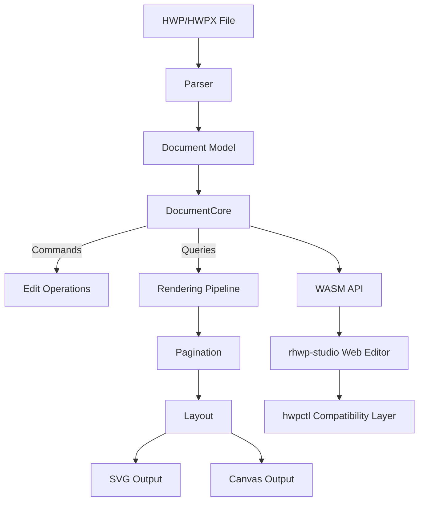

<p align="center">
  
</p>

<h1 align="center">HanPage</h1>

<p align="center">
  <strong>Korean documents anywhere</strong> — no installation, just a browser<br/>
  <em>HWP/HWPX viewer · editor — powered by <a href="https://github.com/edwardkim/rhwp">rhwp</a></em>
</p>

<p align="center">
  <a href="https://github.com/paldyn/HanPage/actions/workflows/ci.yml"></a>
  <a href="https://hwpio.paldyn.com/"></a>
  <a href="https://www.npmjs.com/package/@rhwp/core"></a>
  <a href="https://marketplace.visualstudio.com/items?itemName=edwardkim.rhwp-vscode"></a>
  <a href="https://opensource.org/licenses/MIT"></a>
  <a href="https://www.rust-lang.org/"></a>
  <a href="https://webassembly.org/"></a>
</p>

<p align="center">
  <a href="https://oosmetrics.com/repo/edwardkim/rhwp"></a>
  <a href="https://oosmetrics.com/repo/edwardkim/rhwp"></a>
</p>

<p align="center">
  <a href="README.md">한국어</a> | <strong>English</strong>
</p>

---

**HanPage** is paldyn's hosted redistribution of the open-source HWP/HWPX viewer · editor engine [rhwp](https://github.com/edwardkim/rhwp), served at [hwpio.paldyn.com](https://hwpio.paldyn.com/). Open Korean documents in the browser, no installation required.

**HWP** is the dominant document format in South Korea — used by government agencies, schools, courts, and most organizations. The rhwp engine, written in Rust and compiled to WebAssembly, renders HWP documents directly in the browser with accuracy that matches (and sometimes exceeds) the proprietary viewer.

> **[Live Demo](https://hwpio.paldyn.com/)** | **[VS Code Extension](https://marketplace.visualstudio.com/items?itemName=edwardkim.rhwp-vscode)** | **[Open VSX](https://open-vsx.org/extension/edwardkim/rhwp-vscode)**

<p align="center">
  
</p>

## Engine — rhwp

The parser · renderer · editor engine used by HanPage is the open-source project [rhwp](https://github.com/edwardkim/rhwp). Current engine version **v0.7.13** (MIT License, © 2025-2026 Edward Kim and contributors).

For per-release cycle changes and external contributor credits, see upstream's [CHANGELOG](https://github.com/edwardkim/rhwp/blob/main/CHANGELOG.md) and [Releases](https://github.com/edwardkim/rhwp/releases). This paldyn repository forks the engine and manages the hwpio.paldyn.com hosting and redistribution artifacts.

## Roadmap

Build the skeleton solo, grow the muscle together, complete it as a public good.

```
0.5 ──── 1.0 ──── 2.0 ──── 3.0
Foundation  Typeset   Collab    Complete
```

| Phase | Direction | Strategy |
|-------|-----------|----------|
| **0.5 → 1.0** | Systematize the typesetting engine on a read/write foundation | Build core architecture solo, keep it solid |
| **1.0 → 2.0** | Open community participation on top of an AI-driven typesetting pipeline | Lower the barrier to contribution |
| **2.0 → 3.0** | Let community-built features elevate rhwp to a public asset | Reach parity with Hancom |

> The reason for completing the skeleton alone through v0.5.0 is simple — when the community arrives, the core architecture must already be solid so that direction does not drift.

### v0.5.0 ~ v0.7.x — Foundation (current)

> Reverse-engineering complete, read/write foundation established

- HWP 5.0 / HWPX parser, rendering for paragraphs, tables, equations, images, charts
- Pagination (multi-column split, table row split), headers/footers, master pages, footnotes
- SVG export (CLI) + Canvas rendering (WASM/Web)
- Web editor + hwpctl-compatible API (30 Actions, Field API)
- 1,100+ tests

### v1.0.0 — Typesetting Engine

> AI-driven typesetting pipeline, skeleton complete

- Systematic dynamic reflow on edit (LINE_SEG recomputation + pagination integration)
- AI-driven document generation and editing pipeline
- Document typesetting quality on par with Hancom's viewer

### v2.0.0 — Collaboration

> Community fills out the feature surface — growing the muscle

- Plugin / extension architecture, real-time collaborative editing
- Additional output formats (PDF, DOCX, etc.)

### v3.0.0 — Completion

> On par with Hancom, a full public asset

- Complete HWP feature coverage, accessibility (a11y), mobile support
- Ready for front-line use in government and public institutions

See the [roadmap document](mydocs/eng/report/rhwp-milestone.md) for details.

---

## Features

### Parsing
- HWP 5.0 binary format (OLE2 Compound File)
- HWPX (Open XML-based format)
- Sections, paragraphs, tables, textboxes, images, equations, charts
- Header/footer, master pages, footnotes/endnotes

### Rendering
- **Paragraph layout**: line spacing, indentation, alignment, tab stops
- **Tables**: cell merging, border styles (solid/double/triple/dotted), cell formula calculation
- **Multi-column layout** (2-column, 3-column, etc.)
- **Paragraph numbering/bullets**
- **Vertical text**
- **Header/footer** (odd/even page separation)
- **Master pages** (Both/Odd/Even, is_extension/overlap)
- **Object placement**: TopAndBottom, treat-as-char (TAC), in-front-of/behind text
- **Image crop & border rendering**
- **OLE / Chart / EMF** native rendering (since v0.7.3)

### Equation
- Fractions (OVER), square roots (SQRT/ROOT), subscript/superscript
- Matrices: MATRIX, PMATRIX, BMATRIX, DMATRIX
- Cases, alignment (EQALIGN), stacking (PILE/LPILE/RPILE)
- Large operators: INT, DINT, TINT, OINT, SUM, PROD
- Relations (REL/BUILDREL), limits (lim), long division (LONGDIV)
- 15 text decorations, full Greek alphabet, 100+ math symbols

### Pagination
- Multi-column document column/page splitting
- Table row-level page splitting (PartialTable)
- shape_reserved handling for TopAndBottom objects
- vpos-based paragraph position correction

### Output
- SVG export (CLI, legacy + layer replay)
- Canvas rendering (WASM/Web)
- HWP save path for native HWP editing and HWPX → HWP conversion
- Debug overlay (paragraph/table boundaries + indices + y-coordinates)

### Multi-Renderer Backends
- `PageRenderTree` can be lowered into a `PageLayerTree` paint IR before backend replay.
- P1 public surfaces are Rust native `DocumentCore::build_page_layer_tree(page)` and WASM `getPageLayerTree(page)`.
- Layer JSON starts at `schemaVersion: 1`, uses `unit: "px"`, and uses `coordinateSystem: "page-top-left"` to match the existing page render coordinates.
- Compatible schema changes should be additive; incompatible JSON shape changes require a schema version bump.
- **Legacy SVG** remains the default compatibility output.
- **Layered SVG** can be exercised with `RHWP_RENDER_PATH=layer-svg`.
- The layered SVG path is a transition adapter that expands `PageLayerTree` back into the existing SVG renderer.
- Browser/native Canvas paths render through `PageLayerTree` replay by default.
- Legacy Canvas remains available through `renderPageCanvasLegacy` / `renderPageToCanvasLegacy` for parity checks.
- P3 visual regression coverage runs `npm run e2e:render-diff:ci` in `rhwp-studio` to compare legacy Canvas and layer Canvas in Chromium; CI uploads render-diff artifacts and writes a summary.
- The default render-diff fixtures cover basic text/table output, business-document layout, and treat-as-char object placement; override with `RHWP_RENDER_DIFF_FILES`, `RHWP_RENDER_DIFF_MAX_PAGES`, or `RHWP_RENDER_DIFF_ALL=1`.
- P4 adds native-only `DocumentCore::render_page_png_native(page)` behind `--features native-skia`; it renders `PageLayerTree` to encoded PNG through `SkiaLayerRenderer`.
- P5 adds native Skia equation replay from `EquationNode.layout_box`, so equations are no longer placeholder boxes in the PNG path.
- P5 replays the existing equation layout tree directly; it does not add CanvasKit equation replay or native form replay.
- P6 adds native Skia `RawSvg` fragment rasterization through `resvg`, with external file href loading disabled.
- CI covers the native Skia path with `cargo test --features native-skia skia --lib`; the feature is not available on `wasm32` targets.
- The initial native Skia path is a PNG raster backend with core image/equation/raw-svg replay; CanvasKit, resource interning/cache, complex text shaping, advanced image parity, and native form replay stay as follow-up work.
- C ABI export is intentionally left for a later PR.
- `ResourceArena` is reserved in `PageLayerTree`; binary resource interning is not implemented yet.
- This phase establishes the frontend/backend boundary for later CanvasKit and fuller native Skia backends.

### Web Editor
- Text editing (insert, delete, undo/redo)
- Character/paragraph formatting dialogs
- Table creation, row/column insert/delete, cell formula
- hwpctl-compatible API layer (Hancom WebGian compatible)

### hwpctl Compatibility
- 30 Actions: TableCreate, InsertText, CharShape, ParagraphShape, etc.
- ParameterSet/ParameterArray API
- Field API: GetFieldList, PutFieldText, GetFieldText
- Template data binding support

## npm Packages — Use in Your Web Project

Current release: `@rhwp/core` / `@rhwp/editor` v0.7.13.

### Embed a Full Editor (3 lines)

Embed the complete HWP editor in your web page — menus, toolbars, formatting, table editing, everything included.

```bash
npm install @rhwp/editor
```

```html
<div id="editor" style="width:100%; height:100vh;"></div>
<script type="module">
  import { createEditor } from '@rhwp/editor';
  const editor = await createEditor('#editor');
</script>
```

### HWP Viewer/Parser (Direct API)

Use the WASM-based parser/renderer directly to render HWP files as SVG.

```bash
npm install @rhwp/core
```

```javascript
import init, { HwpDocument } from '@rhwp/core';

globalThis.measureTextWidth = (font, text) => {
  const ctx = document.createElement('canvas').getContext('2d');
  ctx.font = font;
  return ctx.measureText(text).width;
};

await init({ module_or_path: '/rhwp_bg.wasm' });

const resp = await fetch('document.hwp');
const doc = new HwpDocument(new Uint8Array(await resp.arrayBuffer()));
document.getElementById('viewer').innerHTML = doc.renderPageSvg(0);
```

| Package | Purpose | Install |
|---------|---------|---------|
| [@rhwp/editor](https://www.npmjs.com/package/@rhwp/editor) | Full editor UI (iframe embed) | `npm i @rhwp/editor` |
| [@rhwp/core](https://www.npmjs.com/package/@rhwp/core) | WASM parser/renderer (API) | `npm i @rhwp/core` |

## Quick Start (Build from Source)

New contributors: start with the [onboarding guide](mydocs/eng/manual/onboarding_guide.md). It covers project architecture, debugging tools, and the development workflow at a glance.

### Requirements
- Rust 1.93.1 (pinned by `rust-toolchain.toml`)
- Docker (for WASM build)
- Node.js 18+ (for web editor)

### Native Build

```bash
cargo build                    # Development build
cargo build --release          # Release build
cargo test                     # Run tests (1,100+ tests)
```

### WASM Build

The WASM build uses Docker to guarantee an identical `wasm-pack` + Rust toolchain environment across every platform.

```bash
cp .env.docker.example .env.docker   # First time: copy env template
docker compose --env-file .env.docker run --rm wasm
```

Build output goes to `pkg/`.

### Web Editor

```bash
cd rhwp-studio
npm install
npx vite --host 0.0.0.0 --port 7700
```

Open `http://localhost:7700` in your browser.

## CLI Usage

### SVG Export

```bash
rhwp export-svg sample.hwp                         # Export to output/
rhwp export-svg sample.hwp -o my_dir/              # Export to custom directory
rhwp export-svg sample.hwp -p 0                    # Export specific page (0-indexed)
rhwp export-svg sample.hwp --debug-overlay         # Debug overlay (paragraph/table boundaries)
```

### Document Inspection

```bash
rhwp dump sample.hwp                  # Full IR dump
rhwp dump sample.hwp -s 2 -p 45      # Section 2, paragraph 45 only
rhwp dump-pages sample.hwp -p 15     # Page 16 layout items
rhwp info sample.hwp                  # File info (size, version, sections, fonts)
```

### Debugging Workflow

1. `export-svg --debug-overlay` → Identify paragraphs/tables by `s{section}:pi={index} y={coord}`
2. `dump-pages -p N` → Check paragraph layout list and heights
3. `dump -s N -p M` → Inspect ParaShape, LINE_SEG, table properties

No code modification needed for the entire debugging process.

## Project Structure

```
src/
├── main.rs                    # CLI entry point
├── parser/                    # HWP/HWPX file parser
├── model/                     # HWP document model
├── document_core/             # Document core (CQRS: commands + queries)
│   ├── commands/              # Edit commands (text, formatting, tables)
│   ├── queries/               # Queries (rendering data, pagination)
│   └── table_calc/            # Table formula engine (SUM, AVG, PRODUCT, etc.)
├── renderer/                  # Rendering engine
│   ├── layout/                # Layout (paragraph, table, shapes, cells)
│   ├── pagination/            # Pagination engine
│   ├── equation/              # Equation parser/layout/renderer
│   ├── svg.rs                 # SVG output
│   └── web_canvas.rs          # Canvas output
├── emf/                       # EMF parser + SVG converter (since v0.7.3)
├── ooxml_chart/               # OOXML chart parser + SVG renderer (since v0.7.3)
├── serializer/                # HWP file serializer (save)
└── wasm_api.rs                # WASM bindings

rhwp-studio/                   # Web editor (TypeScript + Vite)
├── src/
│   ├── core/                  # Core (WASM bridge, types)
│   ├── engine/                # Input handlers
│   ├── hwpctl/                # hwpctl compatibility layer
│   ├── ui/                    # UI (menus, toolbars, dialogs)
│   └── view/                  # Views (ruler, status bar, canvas)
├── e2e/                       # E2E tests (Puppeteer + Chrome CDP)
│   └── helpers.mjs            # Test helpers (headless/host modes)

rhwp-chrome/                   # Chrome / Edge extension
rhwp-firefox/                  # Firefox extension (MV3)
rhwp-safari/                   # Safari Web Extension
rhwp-shared/                   # Shared code between browser extensions

mydocs/                        # Project documentation (Korean)
├── orders/                    # Daily task tracking
├── plans/                     # Task plans and implementation specs
├── feedback/                  # Code review feedback
├── tech/                      # Technical documents
└── manual/                    # Manuals and guides
mydocs/eng/                    # English translations (2,200+ files)

scripts/                       # Build & quality tools
├── metrics.sh                 # Code quality metrics collection
└── dashboard.html             # Quality dashboard with trend tracking
```

## Built with AI Pair Programming

> **This is not vibe coding.** There is no "just accept what AI gives you." Every plan is reviewed. Every output is verified. Every decision has a human behind it.

Vibe coding — hitting accept without reading, letting AI make architectural decisions, shipping code you don't understand — is a trap. It produces code that *looks* right but breaks in ways you can't diagnose, because you never understood it in the first place.

This project takes the opposite approach. A human **task director** maintains full ownership of direction, quality, and architectural decisions, while AI handles implementation at a speed and scale that would be impossible alone. The key difference: **the human never stops thinking.**

### Vibe Coding vs. Directed AI Development

| | Vibe Coding | This Project |
|--|-------------|-------------|
| **Human role** | Accept AI output | Direct, review, decide |
| **Planning** | None — "just build it" | Written plan → approval → execution |
| **Quality gate** | Hope it works | 1,100+ tests + Clippy + CI + code review |
| **Debugging** | Ask AI to fix AI's bugs | Human diagnoses, AI implements fix |
| **Architecture** | Emergent (accidental) | Deliberate (CQRS, dependency direction) |
| **Documentation** | None | 2,200+ files of process records |
| **Outcome** | Fragile, hard to maintain | Production-grade, 100K+ lines |

AI is a force multiplier, but a multiplier amplifies whatever process you already have. No process × AI = fast chaos. Good process × AI = extraordinary output.

### The Development Process

This project is developed using **[Claude Code](https://claude.ai/code)** (Anthropic's AI coding agent) as a pair programming partner. The entire development process is transparently documented.

```
Task Director (Human)              AI Pair Programmer (Claude Code)
─────────────────────              ────────────────────────────────
Sets direction & priorities   →    Analyzes, plans, implements
Reviews & approves plans      ←    Writes implementation plans
Provides domain feedback      →    Debugs, tests, iterates
Makes architectural decisions →    Executes with precision
Judges quality & correctness  ←    Generates code, docs, tests
```

The `mydocs/` directory (2,200+ files, English translations in `mydocs/eng/`) contains the complete development record: daily task logs, implementation plans, code review feedback, technical research documents, and debugging records.

> `mydocs/` is not documentation about the code — it is documentation about **how to build software with AI**. It is an open-source methodology.

**[Hyper-Waterfall Methodology](mydocs/eng/manual/hyper_waterfall.md)** — macro-level waterfall + micro-level agile, both made possible at once by AI.

### Git Workflow

```
local/task{N}  ──commit──commit──┐
                                  ├─→ devel merge (grouped by related tasks)
                                  ├─→ main merge + tag (release time)
```

| Branch | Purpose |
|--------|---------|
| `main` | Release (tags: v0.5.0 etc.) |
| `devel` | Development integration |
| `local/task{N}` | GitHub Issue-numbered task branch |

### Task Management

- **GitHub Issues** auto-number tasks — no duplicates
- **GitHub Milestones** group related tasks
- Milestone notation: `M{version}` (e.g. M100=v1.0.0, M05x=v0.5.x)
- Daily tasks: `mydocs/orders/yyyymmdd.md` — referenced as `M100 #1`
- Commit messages: `Task #1: <subject>` — `closes #1` auto-closes the issue

### Task Workflow

1. `gh issue create` → register a GitHub Issue (with a milestone)
2. Create `local/task{issue-number}` branch
3. Write an implementation plan → approval → implement → test
4. Merge to `devel` → `closes #{number}`

### Debugging Protocol

1. `export-svg --debug-overlay` → Identify paragraphs/tables
2. `dump-pages -p N` → Inspect the layout item list and heights
3. `dump -s N -p M` → Inspect ParaShape, LINE_SEG details

> The documents under `mydocs/` double as educational material for AI-driven software development.

### Documentation Rules

All project documents are written in **Korean** (with English translations under `mydocs/eng/`).

```
mydocs/
├── orders/           # Daily task logs (yyyymmdd.md)
├── plans/            # Task plans & implementation specs
│   └── archives/     # Archived completed plans
├── working/          # Step-by-step completion reports
├── report/           # Main reports
├── feedback/         # Code review feedback
├── tech/             # Technical documents
├── manual/           # Manuals and guides
└── troubleshootings/ # Troubleshooting records
```

| Document type | Location | Naming rule |
|---------------|----------|-------------|
| Daily task log | `orders/` | `yyyymmdd.md` — references milestone(M100) + issue(#1) |
| Task plan | `plans/` | References the issue number |
| Completion report | `working/` | References the issue number |
| Technical doc | `tech/` | Free-form by topic |

## Architecture



## HWPUNIT

- 1 inch = 7,200 HWPUNIT
- 1 inch = 25.4 mm
- 1 HWPUNIT ≈ 0.00353 mm

## Contributing

This repository (paldyn/HanPage) manages the redistribution and hosting artifacts for the [rhwp](https://github.com/edwardkim/rhwp) engine. Contributions split by category:

- **Engine itself (parser · renderer · pagination · editor · CLI · WASM · extensions)**: please submit PRs to upstream [edwardkim/rhwp](https://github.com/edwardkim/rhwp). The PR base is upstream's `devel`.
- **HanPage hosting / redistribution (CI, gh-pages workflow, domain config, etc.)**: please open [Issues](https://github.com/paldyn/HanPage/issues) / [PRs](https://github.com/paldyn/HanPage/pulls) on this repository.

> **Hancom PDFs are not authoritative ground truth**: PDF output differs across Hancom tools (Editor / Viewer / Hancom Docs), versions (2010 / 2020 / 2022), and output paths (Hancom-native / OS print). See the [Hancom PDF Environment Dependency wiki](https://github.com/edwardkim/rhwp/wiki/한컴-PDF-환경-의존성) for environment-specific comparison data and PR review guidance.

For the full engine contribution flow (fork → branch → commit → PR), see [CONTRIBUTING.md](CONTRIBUTING.md).

### Wiki (upstream rhwp)

Authoritative technical resources for the rhwp engine are organized in the [upstream rhwp Wiki](https://github.com/edwardkim/rhwp/wiki):

- [Hancom PDF Environment Dependency](https://github.com/edwardkim/rhwp/wiki/한컴-PDF-환경-의존성) — PDF differences across Hancom tools / versions / OS, and PR verification guidance
- [HWP 5.0 Spec Errata](https://github.com/edwardkim/rhwp/wiki/HWP-5.0-Spec-Errata) — HWP 5.0 spec errata
- [Understanding HWP LINE_SEG vpos](https://github.com/edwardkim/rhwp/wiki/HWP-LINE_SEG-vpos-이해)
- [HWP Tab Leader Rendering](https://github.com/edwardkim/rhwp/wiki/HWP-Tab-Leader-Rendering)
- [Export API Guide](https://github.com/edwardkim/rhwp/wiki/Export-API-사용-가이드) — exportHwp / exportHwpx APIs
- [Cloudflared for rhwp-studio external HTTPS access](https://github.com/edwardkim/rhwp/wiki/Cloudflared-로-rhwp-studio-외부-HTTPS-접근)
- [Hyper-Waterfall Document Guide](https://github.com/edwardkim/rhwp/wiki/Hyper‐Waterfall-문서-체계-가이드)
- [Investigation PR Guide](https://github.com/edwardkim/rhwp/wiki/Investigation-PR-가이드)
- [Legal FAQ](https://github.com/edwardkim/rhwp/wiki/Legal-FAQ)

## Notice

This product was developed with reference to the HWP (.hwp) file format specification published by Hancom Inc.

## Trademark

"Hangul", "Hancom", "HWP", and "HWPX" are registered trademarks of Hancom Inc.
This project is an independent open-source project with no affiliation, sponsorship, or endorsement by Hancom Inc.

## License

Engine [rhwp](https://github.com/edwardkim/rhwp): [MIT License](LICENSE) — Copyright (c) 2025-2026 Edward Kim and contributors

HanPage redistribution artifacts (additions in this repository): MIT License — Copyright (c) 2026 paldyn

This repository forks rhwp under the MIT License's redistribution grant to host hwpio.paldyn.com. See [LICENSE](LICENSE) and the accompanying license notice files for redistribution details.
