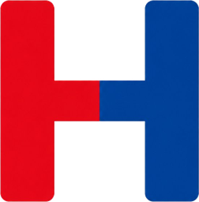
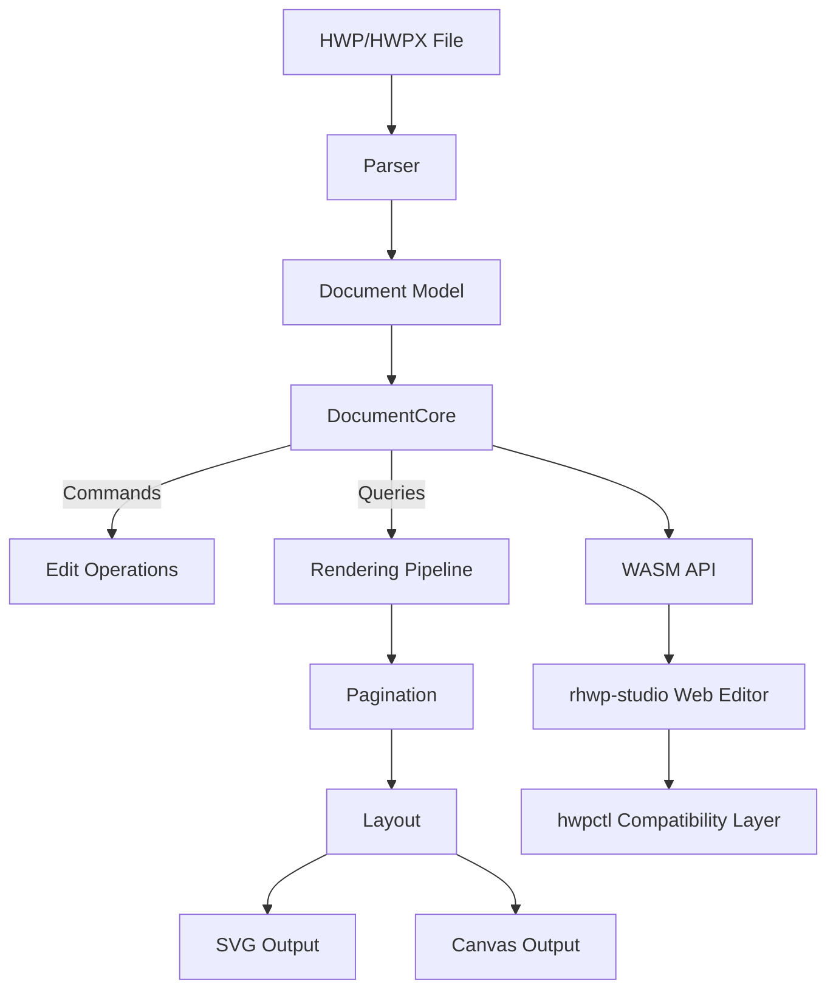

<p align="center">
  
</p>

<h1 align="center">rhwp</h1>

<p align="center">
  <strong>All HWP, Open for Everyone</strong><br/>
  <em>Open-source HWP document viewer & editor — Rust + WebAssembly</em>
</p>

<p align="center">
  <a href="https://github.com/edwardkim/rhwp/actions/workflows/ci.yml"></a>
  <a href="https://edwardkim.github.io/rhwp/"></a>
  <a href="https://www.npmjs.com/package/@rhwp/core"></a>
  <a href="https://marketplace.visualstudio.com/items?itemName=edwardkim.rhwp-vscode"></a>
  <a href="https://opensource.org/licenses/MIT"></a>
  <a href="https://www.rust-lang.org/"></a>
  <a href="https://webassembly.org/"></a>
</p>

<p align="center">
  <a href="https://oosmetrics.com/repo/edwardkim/rhwp"></a>
  <a href="https://oosmetrics.com/repo/edwardkim/rhwp"></a>
</p>

<p align="center">
  <a href="README.md">한국어</a> | <strong>English</strong>
</p>

---

Open **HWP files anywhere**. Free, no installation required.

**HWP** is the dominant document format in South Korea — used by government agencies, schools, courts, and most organizations. Until now, there has been no viable open-source solution to read or edit these files.

rhwp changes that. Built with Rust and compiled to WebAssembly, it renders HWP documents directly in the browser with accuracy that matches (and sometimes exceeds) the proprietary viewer. The goal: break the walls of a closed format so that every person, every AI, and every platform can read and write Korean documents freely.

> **[Live Demo](https://edwardkim.github.io/rhwp/)** | **[VS Code Extension](https://marketplace.visualstudio.com/items?itemName=edwardkim.rhwp-vscode)** | **[Open VSX](https://open-vsx.org/extension/edwardkim/rhwp-vscode)**

<p align="center">
  
</p>

## Roadmap

Build the skeleton solo, grow the muscle together, complete it as a public good.

```
0.5 ──── 1.0 ──── 2.0 ──── 3.0
Foundation  Typeset   Collab    Complete
```

| Phase | Direction | Strategy |
|-------|-----------|----------|
| **0.5 → 1.0** | Systematize the typesetting engine on a read/write foundation | Build core architecture solo, keep it solid |
| **1.0 → 2.0** | Open community participation on top of an AI-driven typesetting pipeline | Lower the barrier to contribution |
| **2.0 → 3.0** | Let community-built features elevate rhwp to a public asset | Reach parity with Hancom |

> The reason for completing the skeleton alone through v0.5.0 is simple — when the community arrives, the core architecture must already be solid so that direction does not drift.

## Milestones

### v0.5.0 ~ v0.7.x — Foundation (current)

> Reverse-engineering complete, read/write foundation established

- HWP 5.0 / HWPX parser, rendering for paragraphs, tables, equations, images, charts
- Pagination (multi-column split, table row split), headers/footers, master pages, footnotes
- SVG export (CLI) + Canvas rendering (WASM/Web)
- Web editor + hwpctl-compatible API (30 Actions, Field API)
- 935+ tests

#### Recent Changes (v0.7.3 / extension v0.2.1, 2026-04-21)

**rhwp-studio (library 0.7.3)**
- HWPX-source documents: save disabled with user notification ([#196](https://github.com/edwardkim/rhwp/issues/196)) — prevents data loss until the HWPX→HWP full converter ([#197](https://github.com/edwardkim/rhwp/issues/197)) lands
- HWPX→HWP IR mapping adapter assets preserved ([#178](https://github.com/edwardkim/rhwp/issues/178)) — rhwp self-roundtrip 100% recovered; Hancom compatibility deferred to #197
- HWPX interleaved control char-offset fix for linebreak/embedded controls ([#213](https://github.com/edwardkim/rhwp/pull/213) by @jskang / [@yl-star7](https://github.com/yl-star7))
- OLE / Chart / EMF native rendering — `<hp:pic>` placeholders, OOXML chart SVG, and native Skia-free EMF → SVG converter for the first time (external contribution by [@planet6897](https://github.com/planet6897) — PR [#221](https://github.com/edwardkim/rhwp/pull/221), 14-stage work)
- HWPX SVG snapshot regression harness ([#173](https://github.com/edwardkim/rhwp/issues/173)) with `UPDATE_GOLDEN=1` regeneration (external contribution by [@seunghan91](https://github.com/seunghan91) — PR [#181](https://github.com/edwardkim/rhwp/pull/181))
- Polygon resize + drag preview + shape-click-to-front (external contribution by [@bapdodi](https://github.com/bapdodi) — PR [#215](https://github.com/edwardkim/rhwp/pull/215))
- Rotated shape resize cursor improvement + Flip handling (external contribution by [@bapdodi](https://github.com/bapdodi) — PR [#192](https://github.com/edwardkim/rhwp/pull/192))
- HWP image effects (grayscale/black-and-white) reflected in SVG (external contribution by [@marsimon](https://github.com/marsimon) — PR [#149](https://github.com/edwardkim/rhwp/pull/149))
- Windows CFB path separator fix (external contribution by [@dreamworker0](https://github.com/dreamworker0) — PR [#152](https://github.com/edwardkim/rhwp/pull/152))
- HWPX Serializer — Document IR → HWPX save (external contribution by [@seunghan91](https://github.com/seunghan91) — PR [#170](https://github.com/edwardkim/rhwp/pull/170))
- HWPX ZIP entry decompression cap + strikeout shape whitelist (external contribution by [@seunghan91](https://github.com/seunghan91) — PR [#153](https://github.com/edwardkim/rhwp/pull/153), PR [#154](https://github.com/edwardkim/rhwp/pull/154))
- Shape resize width/height clamp (external contribution by [@seunghan91](https://github.com/seunghan91) — PR [#163](https://github.com/edwardkim/rhwp/pull/163))
- Mobile dropdown menu icon/label overlap fix (external contribution by [@seunghan91](https://github.com/seunghan91) — PR [#161](https://github.com/edwardkim/rhwp/pull/161))

**rhwp-chrome / Edge extension (v0.2.1)**
- Chrome Web Store and Microsoft Edge Add-ons approved (2026-04-21)
- Restored "remember last save location" for general file downloads while the extension is active ([#198](https://github.com/edwardkim/rhwp/issues/198))
- Options page CSP fix ([#166](https://github.com/edwardkim/rhwp/issues/166))
- CodeQL alert #16 (shell injection in build.mjs) resolved via `execFileSync` migration
- HWP files: `Ctrl+S` overwrites the same file directly (external contribution by [@ahnbu](https://github.com/ahnbu) — PR [#189](https://github.com/edwardkim/rhwp/pull/189))
- Thumbnail loading spinner cleanup + options CSP compatibility (external contribution by [@postmelee](https://github.com/postmelee) — PR [#168](https://github.com/edwardkim/rhwp/pull/168))
- Block empty viewer tab on DEXT5-style download handlers

**rhwp-firefox extension (v0.1.1, AMO submission pending)**
- Firefox MV3 port of rhwp-chrome with `browser.*` namespace, Event Page background, and CSP-compatible options (external contribution by [@postmelee](https://github.com/postmelee) — PR [#169](https://github.com/edwardkim/rhwp/pull/169))
- `__APP_VERSION__` regression fix in `vite.config.ts` (external contribution by [@postmelee](https://github.com/postmelee) — PR [#209](https://github.com/edwardkim/rhwp/pull/209))
- Shared `rhwp-shared/sw/download-interceptor-common.js` module with #198 blacklist / MIME logic wired into Firefox's `onCreated`+`onChanged` dual-callback flow (external contribution by [@postmelee](https://github.com/postmelee) — PR [#214](https://github.com/edwardkim/rhwp/pull/214))

**rhwp-safari extension (v0.2.1)**
- Content-script `init()` gate split to honor hoverPreview / autoOpen independently from showBadges (external contribution by [@postmelee](https://github.com/postmelee) — PR [#224](https://github.com/edwardkim/rhwp/pull/224))

**Thanks to contributors**
This release cycle: [@ahnbu](https://github.com/ahnbu), [@bapdodi](https://github.com/bapdodi), [@dreamworker0](https://github.com/dreamworker0), [@marsimon](https://github.com/marsimon), [@postmelee](https://github.com/postmelee), [@seunghan91](https://github.com/seunghan91), [@seo-rii](https://github.com/seo-rii), [@planet6897](https://github.com/planet6897), [@yl-star7](https://github.com/yl-star7)

### v1.0.0 — Typesetting Engine

> AI-driven typesetting pipeline, skeleton complete

- Systematic dynamic reflow on edit (LINE_SEG recomputation + pagination integration)
- AI-driven document generation and editing pipeline
- Document typesetting quality on par with Hancom's viewer

### v2.0.0 — Collaboration

> Community fills out the feature surface — growing the muscle

- Plugin / extension architecture, real-time collaborative editing
- Additional output formats (PDF, DOCX, etc.)

### v3.0.0 — Completion

> On par with Hancom, a full public asset

- Complete HWP feature coverage, accessibility (a11y), mobile support
- Ready for front-line use in government and public institutions

See the [roadmap document](mydocs/eng/report/rhwp-milestone.md) for details.

---

## Features

### Parsing
- HWP 5.0 binary format (OLE2 Compound File)
- HWPX (Open XML-based format)
- Sections, paragraphs, tables, textboxes, images, equations, charts
- Header/footer, master pages, footnotes/endnotes

### Rendering
- **Paragraph layout**: line spacing, indentation, alignment, tab stops
- **Tables**: cell merging, border styles (solid/double/triple/dotted), cell formula calculation
- **Multi-column layout** (2-column, 3-column, etc.)
- **Paragraph numbering/bullets**
- **Vertical text**
- **Header/footer** (odd/even page separation)
- **Master pages** (Both/Odd/Even, is_extension/overlap)
- **Object placement**: TopAndBottom, treat-as-char (TAC), in-front-of/behind text
- **Image crop & border rendering**
- **OLE / Chart / EMF** native rendering (since v0.7.3)

### Equation
- Fractions (OVER), square roots (SQRT/ROOT), subscript/superscript
- Matrices: MATRIX, PMATRIX, BMATRIX, DMATRIX
- Cases, alignment (EQALIGN), stacking (PILE/LPILE/RPILE)
- Large operators: INT, DINT, TINT, OINT, SUM, PROD
- Relations (REL/BUILDREL), limits (lim), long division (LONGDIV)
- 15 text decorations, full Greek alphabet, 100+ math symbols

### Pagination
- Multi-column document column/page splitting
- Table row-level page splitting (PartialTable)
- shape_reserved handling for TopAndBottom objects
- vpos-based paragraph position correction

### Output
- SVG export (CLI)
- Canvas rendering (WASM/Web)
- Debug overlay (paragraph/table boundaries + indices + y-coordinates)

### Web Editor
- Text editing (insert, delete, undo/redo)
- Character/paragraph formatting dialogs
- Table creation, row/column insert/delete, cell formula
- hwpctl-compatible API layer (Hancom WebGian compatible)

### hwpctl Compatibility
- 30 Actions: TableCreate, InsertText, CharShape, ParagraphShape, etc.
- ParameterSet/ParameterArray API
- Field API: GetFieldList, PutFieldText, GetFieldText
- Template data binding support

## npm Packages — Use in Your Web Project

### Embed a Full Editor (3 lines)

Embed the complete HWP editor in your web page — menus, toolbars, formatting, table editing, everything included.

```bash
npm install @rhwp/editor
```

```html
<div id="editor" style="width:100%; height:100vh;"></div>
<script type="module">
  import { createEditor } from '@rhwp/editor';
  const editor = await createEditor('#editor');
</script>
```

### HWP Viewer/Parser (Direct API)

Use the WASM-based parser/renderer directly to render HWP files as SVG.

```bash
npm install @rhwp/core
```

```javascript
import init, { HwpDocument } from '@rhwp/core';

globalThis.measureTextWidth = (font, text) => {
  const ctx = document.createElement('canvas').getContext('2d');
  ctx.font = font;
  return ctx.measureText(text).width;
};

await init({ module_or_path: '/rhwp_bg.wasm' });

const resp = await fetch('document.hwp');
const doc = new HwpDocument(new Uint8Array(await resp.arrayBuffer()));
document.getElementById('viewer').innerHTML = doc.renderPageSvg(0);
```

| Package | Purpose | Install |
|---------|---------|---------|
| [@rhwp/editor](https://www.npmjs.com/package/@rhwp/editor) | Full editor UI (iframe embed) | `npm i @rhwp/editor` |
| [@rhwp/core](https://www.npmjs.com/package/@rhwp/core) | WASM parser/renderer (API) | `npm i @rhwp/core` |

## Quick Start (Build from Source)

New contributors: start with the [onboarding guide](mydocs/eng/manual/onboarding_guide.md). It covers project architecture, debugging tools, and the development workflow at a glance.

### Requirements
- Rust 1.75+
- Docker (for WASM build)
- Node.js 18+ (for web editor)

### Native Build

```bash
cargo build                    # Development build
cargo build --release          # Release build
cargo test                     # Run tests (935+ tests)
```

### WASM Build

The WASM build uses Docker to guarantee an identical `wasm-pack` + Rust toolchain environment across every platform.

```bash
cp .env.docker.example .env.docker   # First time: copy env template
docker compose --env-file .env.docker run --rm wasm
```

Build output goes to `pkg/`.

### Web Editor

```bash
cd rhwp-studio
npm install
npx vite --host 0.0.0.0 --port 7700
```

Open `http://localhost:7700` in your browser.

## CLI Usage

### SVG Export

```bash
rhwp export-svg sample.hwp                         # Export to output/
rhwp export-svg sample.hwp -o my_dir/              # Export to custom directory
rhwp export-svg sample.hwp -p 0                    # Export specific page (0-indexed)
rhwp export-svg sample.hwp --debug-overlay         # Debug overlay (paragraph/table boundaries)
```

### Document Inspection

```bash
rhwp dump sample.hwp                  # Full IR dump
rhwp dump sample.hwp -s 2 -p 45      # Section 2, paragraph 45 only
rhwp dump-pages sample.hwp -p 15     # Page 16 layout items
rhwp info sample.hwp                  # File info (size, version, sections, fonts)
```

### Debugging Workflow

1. `export-svg --debug-overlay` → Identify paragraphs/tables by `s{section}:pi={index} y={coord}`
2. `dump-pages -p N` → Check paragraph layout list and heights
3. `dump -s N -p M` → Inspect ParaShape, LINE_SEG, table properties

No code modification needed for the entire debugging process.

## Project Structure

```
src/
├── main.rs                    # CLI entry point
├── parser/                    # HWP/HWPX file parser
├── model/                     # HWP document model
├── document_core/             # Document core (CQRS: commands + queries)
│   ├── commands/              # Edit commands (text, formatting, tables)
│   ├── queries/               # Queries (rendering data, pagination)
│   └── table_calc/            # Table formula engine (SUM, AVG, PRODUCT, etc.)
├── renderer/                  # Rendering engine
│   ├── layout/                # Layout (paragraph, table, shapes, cells)
│   ├── pagination/            # Pagination engine
│   ├── equation/              # Equation parser/layout/renderer
│   ├── svg.rs                 # SVG output
│   └── web_canvas.rs          # Canvas output
├── emf/                       # EMF parser + SVG converter (since v0.7.3)
├── ooxml_chart/               # OOXML chart parser + SVG renderer (since v0.7.3)
├── serializer/                # HWP file serializer (save)
└── wasm_api.rs                # WASM bindings

rhwp-studio/                   # Web editor (TypeScript + Vite)
├── src/
│   ├── core/                  # Core (WASM bridge, types)
│   ├── engine/                # Input handlers
│   ├── hwpctl/                # hwpctl compatibility layer
│   ├── ui/                    # UI (menus, toolbars, dialogs)
│   └── view/                  # Views (ruler, status bar, canvas)
├── e2e/                       # E2E tests (Puppeteer + Chrome CDP)
│   └── helpers.mjs            # Test helpers (headless/host modes)

rhwp-chrome/                   # Chrome / Edge extension
rhwp-firefox/                  # Firefox extension (MV3)
rhwp-safari/                   # Safari Web Extension
rhwp-shared/                   # Shared code between browser extensions

mydocs/                        # Project documentation (Korean)
├── orders/                    # Daily task tracking
├── plans/                     # Task plans and implementation specs
├── feedback/                  # Code review feedback
├── tech/                      # Technical documents
└── manual/                    # Manuals and guides
mydocs/eng/                    # English translations (724 files)

scripts/                       # Build & quality tools
├── metrics.sh                 # Code quality metrics collection
└── dashboard.html             # Quality dashboard with trend tracking
```

## Built with AI Pair Programming

> **This is not vibe coding.** There is no "just accept what AI gives you." Every plan is reviewed. Every output is verified. Every decision has a human behind it.

Vibe coding — hitting accept without reading, letting AI make architectural decisions, shipping code you don't understand — is a trap. It produces code that *looks* right but breaks in ways you can't diagnose, because you never understood it in the first place.

This project takes the opposite approach. A human **task director** maintains full ownership of direction, quality, and architectural decisions, while AI handles implementation at a speed and scale that would be impossible alone. The key difference: **the human never stops thinking.**

### Vibe Coding vs. Directed AI Development

| | Vibe Coding | This Project |
|--|-------------|-------------|
| **Human role** | Accept AI output | Direct, review, decide |
| **Planning** | None — "just build it" | Written plan → approval → execution |
| **Quality gate** | Hope it works | 935 tests + Clippy + CI + code review |
| **Debugging** | Ask AI to fix AI's bugs | Human diagnoses, AI implements fix |
| **Architecture** | Emergent (accidental) | Deliberate (CQRS, dependency direction) |
| **Documentation** | None | 724 files of process records |
| **Outcome** | Fragile, hard to maintain | Production-grade, 100K+ lines |

AI is a force multiplier, but a multiplier amplifies whatever process you already have. No process × AI = fast chaos. Good process × AI = extraordinary output.

### The Development Process

This project is developed using **[Claude Code](https://claude.ai/code)** (Anthropic's AI coding agent) as a pair programming partner. The entire development process is transparently documented.

```
Task Director (Human)              AI Pair Programmer (Claude Code)
─────────────────────              ────────────────────────────────
Sets direction & priorities   →    Analyzes, plans, implements
Reviews & approves plans      ←    Writes implementation plans
Provides domain feedback      →    Debugs, tests, iterates
Makes architectural decisions →    Executes with precision
Judges quality & correctness  ←    Generates code, docs, tests
```

The `mydocs/` directory (724 files, English translations in `mydocs/eng/`) contains the complete development record: daily task logs, implementation plans, code review feedback, technical research documents, and debugging records.

> `mydocs/` is not documentation about the code — it is documentation about **how to build software with AI**. It is an open-source methodology.

**[Hyper-Waterfall Methodology](mydocs/eng/manual/hyper_waterfall.md)** — macro-level waterfall + micro-level agile, both made possible at once by AI.

### Git Workflow

```
local/task{N}  ──commit──commit──┐
                                  ├─→ devel merge (grouped by related tasks)
                                  ├─→ main merge + tag (release time)
```

| Branch | Purpose |
|--------|---------|
| `main` | Release (tags: v0.5.0 etc.) |
| `devel` | Development integration |
| `local/task{N}` | GitHub Issue-numbered task branch |

### Task Management

- **GitHub Issues** auto-number tasks — no duplicates
- **GitHub Milestones** group related tasks
- Milestone notation: `M{version}` (e.g. M100=v1.0.0, M05x=v0.5.x)
- Daily tasks: `mydocs/orders/yyyymmdd.md` — referenced as `M100 #1`
- Commit messages: `Task #1: <subject>` — `closes #1` auto-closes the issue

### Task Workflow

1. `gh issue create` → register a GitHub Issue (with a milestone)
2. Create `local/task{issue-number}` branch
3. Write an implementation plan → approval → implement → test
4. Merge to `devel` → `closes #{number}`

### Debugging Protocol

1. `export-svg --debug-overlay` → Identify paragraphs/tables
2. `dump-pages -p N` → Inspect the layout item list and heights
3. `dump -s N -p M` → Inspect ParaShape, LINE_SEG details

> The documents under `mydocs/` double as educational material for AI-driven software development.

### Documentation Rules

All project documents are written in **Korean** (with English translations under `mydocs/eng/`).

```
mydocs/
├── orders/           # Daily task logs (yyyymmdd.md)
├── plans/            # Task plans & implementation specs
│   └── archives/     # Archived completed plans
├── working/          # Step-by-step completion reports
├── report/           # Main reports
├── feedback/         # Code review feedback
├── tech/             # Technical documents
├── manual/           # Manuals and guides
└── troubleshootings/ # Troubleshooting records
```

| Document type | Location | Naming rule |
|---------------|----------|-------------|
| Daily task log | `orders/` | `yyyymmdd.md` — references milestone(M100) + issue(#1) |
| Task plan | `plans/` | References the issue number |
| Completion report | `working/` | References the issue number |
| Technical doc | `tech/` | Free-form by topic |

## Architecture



## HWPUNIT

- 1 inch = 7,200 HWPUNIT
- 1 inch = 25.4 mm
- 1 HWPUNIT ≈ 0.00353 mm

## Contributing

See [CONTRIBUTING.md](CONTRIBUTING.md) for guidelines.

Questions and ideas are welcome on [Discussions](https://github.com/edwardkim/rhwp/discussions).

## Notice

This product was developed with reference to the HWP (.hwp) file format specification published by Hancom Inc.

## Trademark

"Hangul", "Hancom", "HWP", and "HWPX" are registered trademarks of Hancom Inc.
This project is an independent open-source project with no affiliation, sponsorship, or endorsement by Hancom Inc.

## License

[MIT License](LICENSE) — Copyright (c) 2025-2026 Edward Kim
