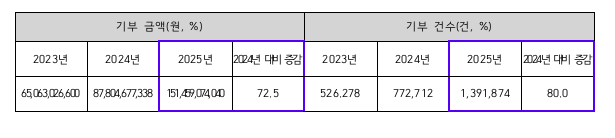
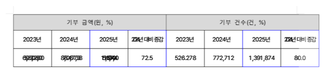
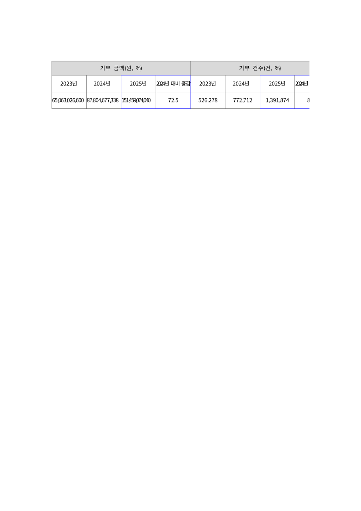

# Task #229 — 표 셀 내 긴 숫자 텍스트 겹침 및 셀 폭 미사용 해결

## 현상
표 셀의 CharShape에 음수 `letter_spacing`(예: `spacing="-24"`)이 지정된 긴 숫자 텍스트를 렌더링할 때 두 가지 문제가 동시 발생.

1. **글자 겹침**: 음수 자간이 글리프 폭보다 크게 적용되어 인접 글자가 겹쳐 판독 불가.
2. **셀 폭 미사용**: 압축된 텍스트가 셀 가용 폭의 절반 수준만 차지.

## 재현
- 파일: [`samples/표-텍스트.hwpx`](../../../samples/표-텍스트.hwpx) (3행 8열, 숫자 셀 CS10 `spacing=-24`)
- 명령: `rhwp export-svg samples/표-텍스트.hwpx --embed-fonts`

## 비교 이미지
| 한컴 (기대) | rhwp 수정 전 | rhwp 수정 후 |
|---|---|---|
|  |  |  |

## 수정 요약
1. `src/renderer/layout/text_measurement.rs` — per-char advance가 `base_w * ratio * 0.5` 미만이 되지 않도록 클램프 (EmbeddedTextMeasurer, WasmTextMeasurer, estimate_text_width_unrounded).
2. `src/renderer/layout/paragraph_layout.rs` — 오버플로우/Justify/Distribute 압축 자간을 `-avg_char_w * 0.5`로 클램프.
3. `src/renderer/layout/table_layout.rs` — `shrink_cell_padding_for_overflow` 헬퍼 추가. 자연 폭(letter_spacing=0 기준)이 가용 폭 초과 시 좌우 패딩을 비례 축소(최소 1px).
4. `src/renderer/layout/table_{layout,partial,cell_content}.rs` — 세 셀 레이아웃 경로에서 헬퍼 호출.
5. `src/renderer/layout/paragraph_layout.rs` — 표 셀 내 음수 `letter_spacing`으로 압축된 텍스트가 가용 폭보다 좁으면 `extra_char_spacing`을 양수로 확장(fill_factor=1.0)하여 셀 inner 폭 100% 충전. `effective_text_width` 기반으로 Center 정렬의 x_start 재계산.

## 검증
- `cargo test --release --lib` — 890 passed, 0 failed.
